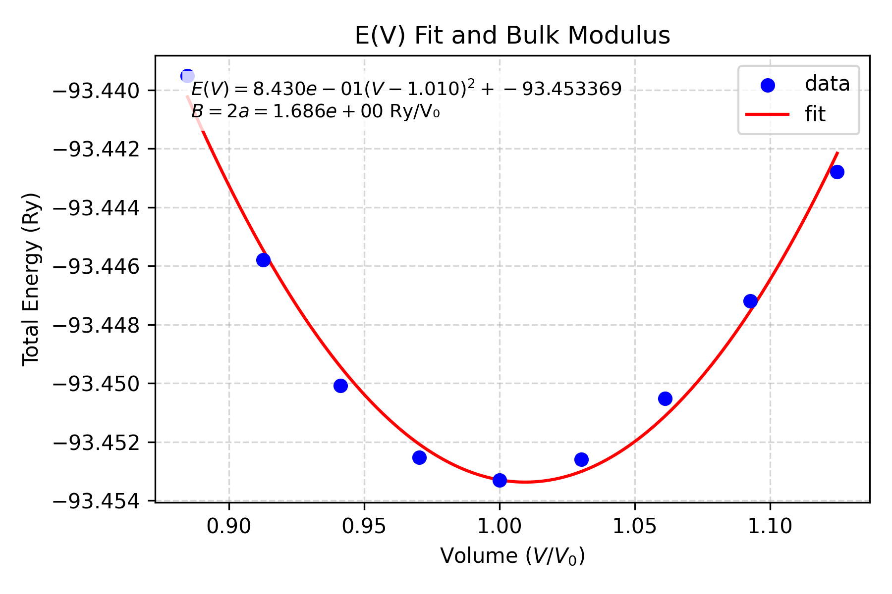

# Bulk Modulus

`qe bulk_modulus` has two modes:

- Prepare mode writes scaled SCF input files from one `scf.in`.
- Analysis mode reads finished `a*_scf.out` files, fits `E(V/V0)`, and saves plots/data.

## Suggested Folder Structure

Run this workflow inside one SCF folder:

```text
material/
  01-SCF/
    scf.in
    a0.96_scf.in
    a0.97_scf.in
    a0.98_scf.in
    a0.99_scf.in
    a1_scf.in
    a1.01_scf.in
    a1.02_scf.in
    a0.96_scf.out
    a0.97_scf.out
    a0.98_scf.out
    a0.99_scf.out
    a1_scf.out
    a1.01_scf.out
    a1.02_scf.out
    bulk_EV.png
    bulk_EV_data.csv
```

## Prepare Scaled Inputs

Default scale set:

```bash
cd material/01-SCF
qe bulk_modulus --prepare
```

Custom scale set:

```bash
qe bulk_modulus --in scf.in --prepare 0.97,0.98,0.99,1,1.01,1.02,1.03
```

The command prints a template run script:

```bash
mpirun -np 8 $PWX -in a0.97_scf.in > a0.97_scf.out
```

## Analyze Finished Outputs

```bash
qe bulk_modulus
```

Also plot magnetization versus volume:

```bash
qe bulk_modulus --magvol
```

## Flags

| Flag | Meaning |
| --- | --- |
| `--in PATH` | Input QE file for prepare mode. Default: `scf.in`. |
| `-pp`, `--prepare [SCALES]` | Enable prepare mode. With no value, uses `0.96,0.97,0.98,0.99,1,1.01,1.02,1.03,1.04`. With a value, parse comma-separated scale factors. |
| `-MV`, `--magvol` | In analysis mode, also save magnetization plots. |
| `--display` | Show plots interactively in addition to saving. |

## Expected Input

Prepare mode expects:

- `scf.in`
- A `CELL_PARAMETERS` block in angstrom units.

Analysis mode expects:

- At least three output files matching `a*_scf.out`.
- Filenames beginning with the scale factor, such as `a0.98_scf.out`.
- Each output must contain a QE total-energy line: `! total energy = ... Ry`.
- Magnetization plots use `total magnetization = ... Bohr` when present.

## Output

- `a<scale>_scf.in` files in prepare mode.
- `bulk_EV.png` in analysis mode.
- `bulk_EV_data.csv` containing normalized volume, energy, magnetization, and filename.
- With `--magvol`: `bulk_MV.png` and `bulk_MV_marked.png`.

Example output:


