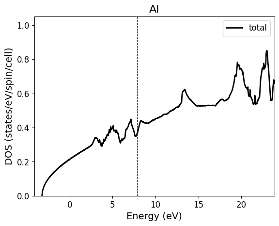
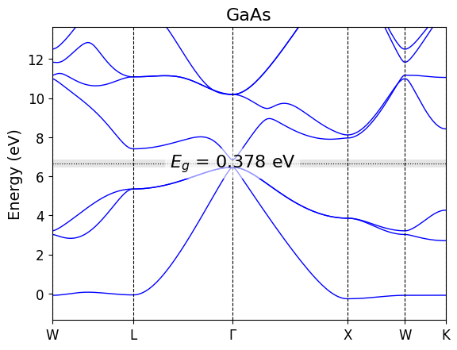

# Electronic DOS and Band Plots

These commands plot common electronic-structure outputs from Quantum ESPRESSO.

## Suggested Folder Structure

Keep each calculation stage in a separate folder, with copied or linked files where the plotting command runs:

```text
material/
  01-SCF/
    scf.in
    scf.out
  02-DOS/
    nscf.in
    nscf.out
    Material.pdos_tot
    Material.pdos_atm#1(Material)_wfc#1(s)
    Material.pdos_atm#1(Material)_wfc#2(p)
  03-BAND/
    band.in
    bands.in
    Material_bands.dat.gnu
```

Spin-polarized band calculations normally use two `bands*.in` files:

```text
03-BAND/
  band.in
  bands_up.in
  bands_dn.in
  Material_bands_up.dat.gnu
  Material_bands_dn.dat.gnu
```

## `qe plot_dos`

Plots total DOS from `*.pdos_tot`, optionally with grouped PDOS curves from `*.pdos_atm*`.

Basic run:

```bash
cd material/02-DOS
qe plot_dos --gap
```

Explicit files:

```bash
qe plot_dos \
  --pdos-tot Material.pdos_tot \
  --nscf-in nscf.in \
  --nscf-out nscf.out \
  --group elem,orb \
  --save-png Material_dos.png
```

### Flags

| Flag | Meaning |
| --- | --- |
| `--pdos-tot PATH` | Total DOS file. If omitted, the command searches for one `*.pdos_tot` file in the current folder. |
| `--nscf-in PATH` | QE input used to read `nspin`. Defaults to `nscf.in` in the current folder. |
| `--nscf-out PATH` | QE output used to read the Fermi level. Defaults to `nscf.out` in the current folder. |
| `--pdos-files A,B,C` | Comma-separated PDOS files. If omitted and `--group` is set, files matching `<prefix>.pdos_atm*` are used. |
| `--group KEYS` | Comma-separated grouping keys. Supported keys are `elem`, `site`, and `orb`. Examples: `orb`, `elem,orb`, `elem,site,orb`. |
| `--gap` | Compute and annotate the DOS band gap when a gap is detected. |
| `--xlim XMIN XMAX` | Energy window relative to Fermi energy. Default: `-8 7`. |
| `--save-png PATH` | Output image path. Default: `<prefix>_dos.png`. |
| `--display` | Show the plot interactively instead of saving only. |

### Expected Input

- `*.pdos_tot` from `projwfc.x`.
- `nscf.in` containing `nspin` when spin detection is needed.
- `nscf.out` containing either a Fermi energy line, highest occupied/lowest unoccupied levels, or highest occupied level.
- Optional `*.pdos_atm#...` files named with the standard QE PDOS pattern.

### Output

- Default PNG: `<prefix>_dos.png`
- The plot is centered around the Fermi level when `nscf.out` is available.
- Spin-polarized DOS is plotted with spin-down mirrored below zero.

Example output:



## `qe plot_band`

Plots electronic band structures from `bands.x` `.gnu` output.

Basic run:

```bash
cd material/03-BAND
qe plot_band --gap
```

Explicit files:

```bash
qe plot_band \
  --band-in band.in \
  --bands-in bands.in \
  --nscf-out ../02-DOS/nscf.out \
  --ylim -6 6 \
  --save-png Material_band.png
```

Spin-polarized example:

```bash
qe plot_band \
  --band-in band.in \
  --bands-in bands_up.in,bands_dn.in \
  --nscf-out ../02-DOS/nscf.out
```

### Flags

| Flag | Meaning |
| --- | --- |
| `--band-in PATH` | QE band-path input containing the `K_POINTS crystal_b` block. Defaults to `band.in`. |
| `--bands-in A,B` | Comma-separated `bands.x` input files. If omitted, the command discovers `bands.in` or `*bands*.in`. |
| `--nscf-out PATH` | QE output used to read Fermi energy. If omitted, the command searches for `nscf.out`, then `scf.out`, including sibling folders. |
| `--gap` | Compute and annotate the band gap when Fermi energy is available. |
| `--ylim YMIN YMAX` | Energy window relative to Fermi energy. Default: `-8 7`. |
| `--save-png PATH` | Output image path. Default: `<prefix>_band.png`, where prefix comes from `band.in`. |
| `--display` | Show the plot interactively instead of saving only. |

### Expected Input

- `band.in` with `prefix = 'Material'`, `nspin`, and a labeled `K_POINTS crystal_b` path.
- One `bands.in` for non-spin-polarized runs, or two files for `nspin = 2`.
- Each `bands.in` must contain `filband = '...'`; the plotted data file must be `<filband>.gnu`.
- `nscf.out` or `scf.out` for Fermi energy and band-gap annotation.

If tick labels fail because QE reduced the k-path, rerun the band calculation with `nosym = .true.`, `noinv = .true.` in `band.in` and `lsym = .false.` in `bands.in`.

### Output

- Default PNG: `<prefix>_band.png`
- High-symmetry labels come from comments in `band.in`, for example `! G`, `! X`, `! M`.

Example output:


