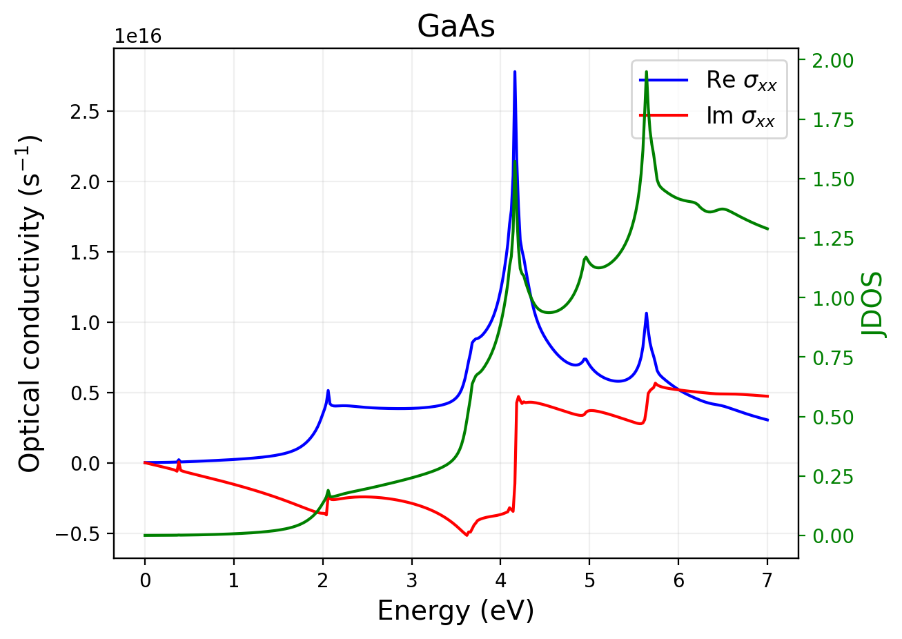
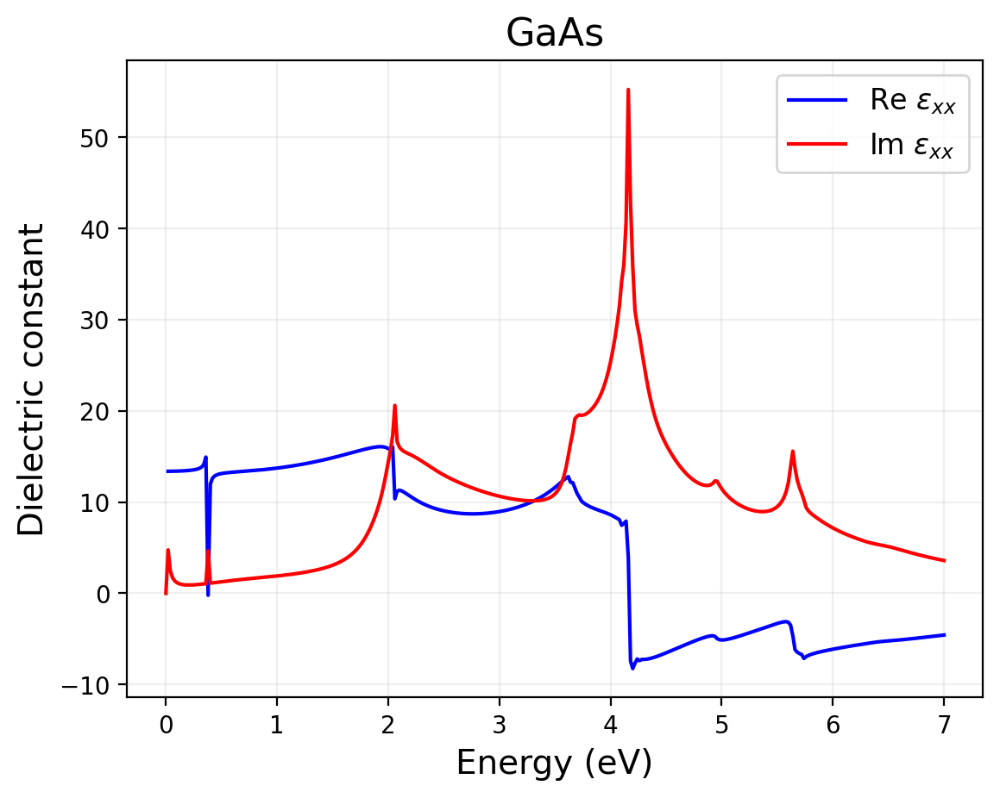
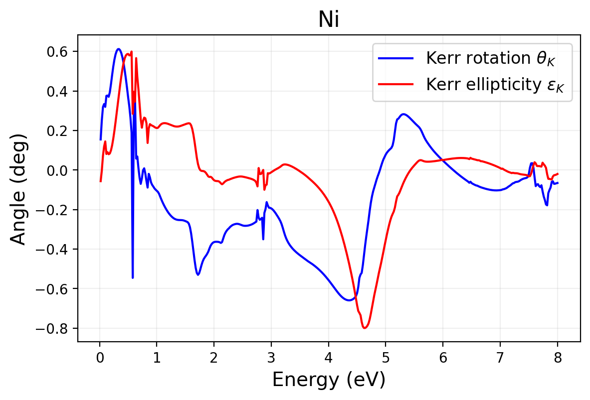

# Optical Conductivity, Dielectric Function, and Kerr Rotation

These commands plot Wannier90 `postw90` Kubo outputs.

## Suggested Folder Structure

Keep `postw90` outputs in one folder with the seed `.win` file:

```text
material/
  7-POSTW/
    Material.win
    Material-kubo_S_xx.dat
    Material-kubo_S_yy.dat
    Material-kubo_S_zz.dat
    Material-kubo_A_xy.dat
    Material-jdos.dat
    Material_opt_cond_S_xx.png
    Material_dielectric_S_xx.png
```

For MOKE/Kerr:

```text
material/
  7-POSTW/
    Material.win
    Material-kubo_S_xx.dat
    Material-kubo_A_xy.dat
    Material_kerr.png
```

If exactly one `*.win` file is present, the commands infer `prefix` from it. Otherwise pass `--prefix`.

## `qe plot_opt`

Plots real and imaginary optical conductivity for one tensor component.

```bash
cd material/7-POSTW
qe plot_opt S_xx --jdos
```

Explicit prefix and output:

```bash
qe plot_opt A_xy --prefix Material --soc --unit S/cm --save-png Material_opt_cond_A_xy.png
```

### Flags

| Flag | Meaning |
| --- | --- |
| `component` | Required tensor component. Supported examples: `S_xx`, `S_yy`, `S_zz`, `S_xy`, `S_xz`, `S_yz`, `A_xy`, `A_yz`, `A_zx`. |
| `--prefix NAME` | Wannier90 seedname. Defaults to the only `*.win` file in the current folder. |
| `--unit UNIT` | Output unit: `S/cm`, `S/m`, or `s^-1`. Default: `S/cm`. |
| `--jdos` | Overlay `<prefix>-jdos.dat` on a second axis. |
| `--soc` | Use no spin-degeneracy factor. Use for SOC or magnetic calculations. |
| `--save-png PATH` | Output image path. Default: `<prefix>_opt_cond_<component>.png`. |
| `--display` | Show the plot interactively instead of saving only. |

### Expected Input and Output

Input file for `S_xx` is `<prefix>-kubo_S_xx.dat`; for `A_xy`, `<prefix>-kubo_A_xy.dat`. Each file must have at least three columns: energy, real part, imaginary part.

Output defaults to `<prefix>_opt_cond_<component>.png`.

Example output:



## `qe plot_die`

Computes and plots dielectric response from the symmetric Kubo conductivity.

```bash
qe plot_die --component S_xx
```

With custom high-frequency dielectric constant:

```bash
qe plot_die --component S_xx --eps-inf 11.7 --prefix Material
```

### Flags

| Flag | Meaning |
| --- | --- |
| `--component COMPONENT` | Conductivity component used for dielectric conversion. Supported symmetric components include `S_xx`, `S_yy`, `S_zz`, `S_xy`, `S_xz`, `S_yz`. Default: `S_xx`. |
| `--prefix NAME` | Wannier90 seedname. Defaults to the only `*.win` file in the current folder. |
| `--eps-inf VALUE` | High-frequency dielectric constant. Default: `1.0`. |
| `--soc` | Use no spin-degeneracy factor. Use for SOC or magnetic calculations. |
| `--save-png PATH` | Output image path. Default: `<prefix>_dielectric_<component>.png`. |
| `--display` | Show the plot interactively instead of saving only. |

### Expected Input and Output

Input is `<prefix>-kubo_<component>.dat`, with columns energy, real conductivity, imaginary conductivity. Output defaults to `<prefix>_dielectric_<component>.png`.

Example output:



## `qe plot_kerr`

Plots Kerr rotation and ellipticity from longitudinal and transverse Kubo conductivities.

```bash
qe plot_kerr --prefix Ni
```

Radians instead of degrees:

```bash
qe plot_kerr --prefix Ni --unit rad
```

### Flags

| Flag | Meaning |
| --- | --- |
| `--prefix NAME` | Wannier90 seedname. Defaults to the only `*.win` file in the current folder. |
| `--unit UNIT` | Angle unit: `deg` or `rad`. Default: `deg`. |
| `--save-png PATH` | Output image path. Default: `<prefix>_kerr.png`. |
| `--display` | Show the plot interactively instead of saving only. |
| `--flip-sign` | Uses the parser's `store_false` behavior for the sign convention flag. By default the plotted sign is flipped; passing this flag disables that flip. |

### Expected Input and Output

Input files:

- `<prefix>-kubo_S_xx.dat`
- `<prefix>-kubo_A_xy.dat`

Both must have matching energy grids and at least three columns: energy, real part, imaginary part. Output defaults to `<prefix>_kerr.png`.

Example output:


