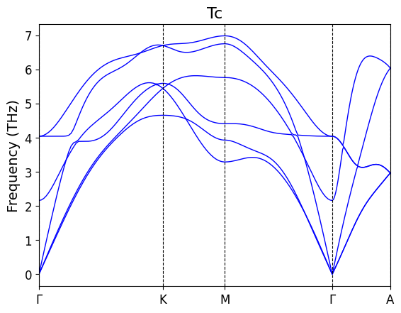
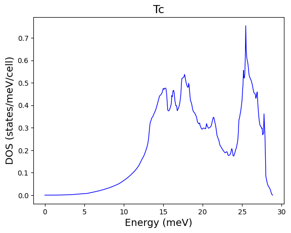
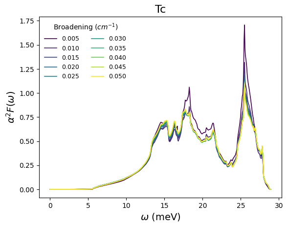

# Phonon Plots

These commands plot Quantum ESPRESSO phonon, `matdyn.x`, and electron-phonon outputs.

## Suggested Folder Structure

```text
material/
  3-PHONON/
    matdyn.in
    high_sym.txt
    Material.freq
    Material.freq.gp
    Material.phonon.dos
    lambda
    a2F.dos1
    a2F.dos2
    Material_phonon_band.png
    Material_phonon_dos.png
    Material_a2f.png
```

The commands infer `prefix` from a single `*.freq` file in the current folder. If the folder contains zero or multiple `*.freq` files, pass `--prefix`.

## `qe plot_phonon_band`

Plots phonon dispersion from `<prefix>.freq.gp`.

```bash
cd material/3-PHONON
qe plot_phonon_band
```

Explicit inputs:

```bash
qe plot_phonon_band \
  --prefix Material \
  --freq-gp Material.freq.gp \
  --band-in matdyn.in \
  --high-sym high_sym.txt \
  --unit meV
```

### Flags

| Flag | Meaning |
| --- | --- |
| `--prefix NAME` | Calculation prefix. Defaults to the only `*.freq` file in the current folder. |
| `--freq-gp PATH` | Phonon band data file. Default: `<prefix>.freq.gp`. |
| `--band-in PATH` | `matdyn.in` file used to read q-path labels. Default: `matdyn.in`. |
| `--high-sym PATH` | Text output containing `high-symmetry point:` lines and x coordinates. Default: `high_sym.txt`. |
| `--unit UNIT` | Y-axis unit: `cm^-1`, `eV`, `Thz`, or `meV`. Default: `Thz`. |
| `--save-png PATH` | Output image path. Default: `<prefix>_phonon_band.png`. |
| `--display` | Show the plot interactively instead of saving only. |

### Expected Input and Output

Input `<prefix>.freq.gp` must have one x-coordinate column and one or more frequency columns in `cm^-1`. Labels are read from comments in `matdyn.in`; exact tick positions are read from `high_sym.txt` when available.

Output defaults to `<prefix>_phonon_band.png`.

Example output:



## `qe plot_phonon_dos`

Plots phonon DOS from `<prefix>.phonon.dos`.

```bash
qe plot_phonon_dos --energy-unit meV
```

### Flags

| Flag | Meaning |
| --- | --- |
| `--prefix NAME` | Calculation prefix. Defaults to the only `*.freq` file in the current folder. |
| `--phonon-dos PATH` | Phonon DOS file. Default: `<prefix>.phonon.dos`. |
| `--energy-unit UNIT` | X-axis unit: `cm^-1`, `eV`, `Thz`, or `meV`. Default: `meV`. |
| `--save-png PATH` | Output image path. Default: `<prefix>_phonon_dos.png`. |
| `--display` | Show the plot interactively instead of saving only. |

### Expected Input and Output

Input must have at least two columns: energy/frequency and DOS. The first column is interpreted as `cm^-1`.

Output defaults to `<prefix>_phonon_dos.png`.

Example output:



## `qe plot_a2f`

Plots Eliashberg spectral function files `a2F.dos1`, `a2F.dos2`, and so on.

```bash
qe plot_a2f --energy-unit meV
```

### Flags

| Flag | Meaning |
| --- | --- |
| `--prefix NAME` | Calculation prefix. Defaults to the only `*.freq` file in the current folder. |
| `--energy-unit UNIT` | X-axis unit: `cm^-1`, `eV`, `Thz`, or `meV`. Default: `meV`. |
| `--save-png PATH` | Output image path. Default: `<prefix>_a2f.png`. |
| `--display` | Show the plot interactively instead of saving only. |

### Expected Input and Output

Input files:

- `lambda`, containing broadening records.
- `a2F.dos1`, `a2F.dos2`, ... matching the number of broadenings parsed from `lambda`.
- A single `*.freq` file, unless `--prefix` is passed.

Output defaults to `<prefix>_a2f.png`.

Example output:


